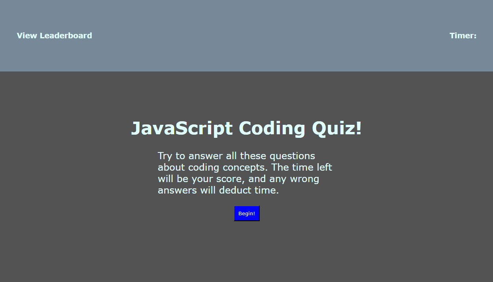
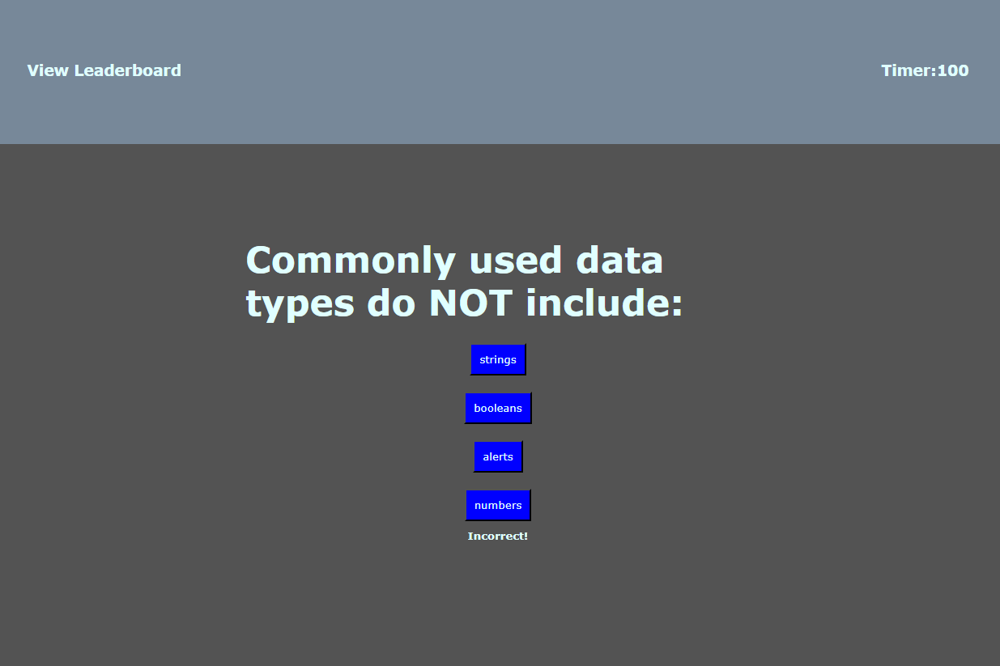
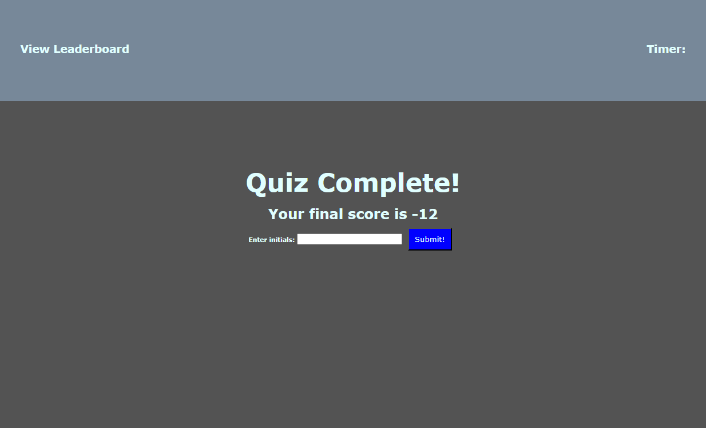
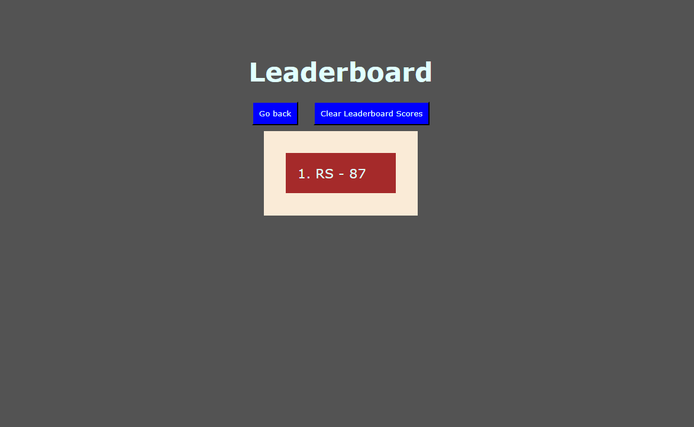

# Code Quiz

## Description

Interview preparations require a functional place to test our knowledge as programmers, so here's a framework for making multiple choice questions in a simple, well-formatted website! In order to practice traversing the DOM, accessing web APIs, utilizing local storage, and engaging in more complicated JavaScript code, I created this site from scratch. This project taught me a lot about how to work with arrays properly in JS, as well as my first time understanding proper use cases for objects (especially when NOT to use them). Although the UI and styling isn't my best work, an opportunity for future work on the page would make this a really nice application, as well as potentially creating an easier way to input questions, rather than creating a whole new object each time.

## Installation

[Access the website by clicking here!](https://redknight88.github.io/code-quiz/index.html)

## Usage

The quiz is built on buttons, so all it takes is one click and you're off to the races! You'll test your knowledge on coding concepts and syntax while the timer counts down. Once the timer hits 0, or after you answer all the questions, you'll be taken to a result entry page. You'll be shown your score, and be given an opportunity to store your score locally by typing your initials and hitting the submit button. This will take you to the other html file, which will load the scores from that local storage and display them in order of most recent first. This page will also allow you to clear the local storage at any time, or go back to the main page. The leaderboard is always accessible by the hyperlink at the top of the page. Test your knowledge today!

